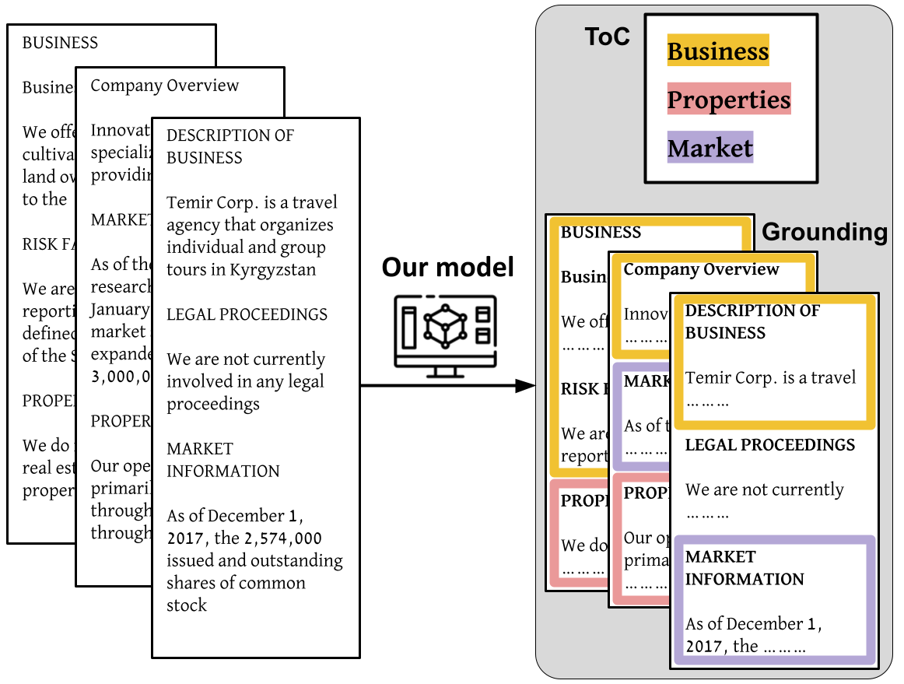
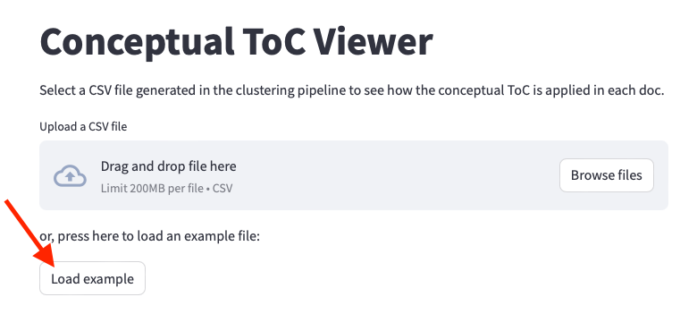

# Doc-Structure-Parser

This repo is the an unsupervised method to extract the conceptual table of contents of a data collection, i.e., the underlying structure of a typical document within the collection. Our method recieve a document collection as an input, and outputs the typical structure of a document along with a mapping between each ToC entry to specifc text spans within each document, as examplified in the figure below.
<p align="center">

</p>

## Demo

We provide a streamlit demo to visualize the method's output at:

[https://visualize-collection-wide-structure.streamlit.app](https://visualize-collection-wide-structure.streamlit.app)

To see the example of our method's output over a collection of 500 financial reports (Form-10K), hit the "Load example" button (marked by the red arrow below)




## Quickstart

In this section we provide the steps to setup and run the method.

### Prepare the environment

```
git clone <github_url>
cd <NAME>
python3 -m venv .venv
source venv/bin/activate
pip install -r requirements.txt
python -m spacy download en_core_web_lg
```

### Run the document parser

```
cd parser
./run_all.sh -m MODEL --ds_name DATASET_NAME -i INPUT_DIR -o OUTPUT_DIR  \
    --w_title W_TITLE --w_text W_TEXT --w_index W_INDEX
```

Parameters:
- `MODEL`: name of the model used for encoding, loaded via sentence_transformers package. 
List of available models can be found [here](https://www.sbert.net/docs/pretrained_models.html).
- `DATASET_NAME`: name of the dataset to parse, used for headers detection in [`generate_nodes_info.py`](parser/generate_nodes_info.py). 
See [#Apply New Dataset](#apply-new-dataset) for further explanation on how to run this code on your own dataset.
- `INPUT_DIR`: path to the directory containing the dataset to parse. 
This directory is expected to contain plain text files.
- `OUTPUT_DIR`: path to the directory where the output will be saved. 
See [#Output Files](#output-files) for further explanation on the directory format and the files it contains.
this `OUTPUT_DIR` parameter must end with a seperator (i.e., '/').
- `W_TITLE`, `W_TEXT`, `W_INDEX`: weights used for the graph building. 
The edges in the graph are weighted sum of the three similarities measures, weighted according these given ws, based on prior information regarding the specific dataset. 
For example, if you think that in your dataset the titles are very similar but the order is not strict, set high W_TITLE and low W_INDEX. 

## Apply New Dataset

In order to run this code on your own data, the only thing you to provide is a method that detects header candidates.

This method accepts as an input a string which is a line from the text and a tokenizer, and it is expected to return a boolean value indicating whether this line is a header candidate or not.

This method should be implemented in the file [`generate_nodes_info.py`](parser/generate_nodes_info.py). It should be called from the function `is_title_candidate`. The following pair of lines should be added, similarly to the existing implementation of 10k and CUAD:
```
elif ds_name == 'DATASET_NAME':
    return is_title_candidate_DATASET_NAME(line, tokenizer)
```

Headers can be detected according to heuristics like number of tokens in the sentence, percentage of capitalized words, and any prior knowledge you may have regarding the dataset.

## Output Files

The output directory will look as follows:
```
├── meta.csv
├── <model_name>
│   ├── meta.csv
│   ├── title_sim.npy
│   ├── section_sim.npy
│   ├── index_sim.npy
│   ├── logs
│   │   ├── 01_nodes_info.log
│   │   ├── 02_similarities.log
│   │   ├── 03_louvain.log
│   │   ├── 04_representative.log
│   │   ├── 05_comm_duplicates.log
│   ├── <w>title_<w>text_<w>index
│   │   ├── meta.csv
│   │   ├── meta_filtered.csv
```

The final output is the file `meta_filtered.csv` in the `<model_name>/<w>title_<w>text_<w>index` directory.
Each line in this csv represents a section in a document from the dataset, along with information regarding its mapping to the Conceptual Table of Contents of the data collection.

`<model_name>` is the name of the model used for encoding and `<w>title_<w>text_<w>index` are the different weights set when building the graph for louvain algorithm.

## Visualize Results

Two options to view the results:

1. Use our provided streamlit app [https://visualize-collection-wide-structure.streamlit.app](https://visualize-collection-wide-structure.streamlit.app) and upload your own csv, which is located in `<output_dir>/<model_name>/<w>title_<w>text_<w>index/meta_filtered.csv`.
2. Run locally on your computer with the following command:
```
streamlit run utils/visualize_predictions.py -- <output_dir>/<model_name>/<w>title_<w>text_<w>index/meta_filtered.csv
```


You can scroll between the different documents, and control how many entries you want to include in the ToC. This will be determined according their coverage rank (see the paper for further details about coverage and clusters ranking).

## Evaluation Scripts

In [`utils`](utils/) We supply few scripts that can help you evaluate your model in two manners:

1. Clustering evaluation:
   - [`generate_intruder_test.py`](utils/generate_intruder_test.py): prepare the data for crowdsourcing experiment, testing if an intruder can be detected out of 9 other titles from the same cluster. The output files match the expected format for Mechanical Turk HITs.
     ```
     python generate_intruder_test.py --path PREDICTIONS --out_dir OUT_DIR [--override]
     ```
   - Next, you need to run on your own the experiments on Mechanical Turk (or any other crowd sourcing platform).
   - [`intruder_eval.py`](utils/intruder_eval.py): assuming the output format of mechanical turk, this script receives as an input a path to directory with all the batches results, accumulating them into accuracy and confidence measures for the intrusion detection.
     ```
     python utils/intruder_eval.py --path CROWDSORCING_ANNOTATIONS_DIRECTORY
     ```
2. Grounding evaluation: 
   - [`grounding_eval.py`](utils/grounding_eval.py): a script that given some gold labels, evaluates precision, recall and F1 scores, along with comparison to two baselines (random and predict the most frequent class). You need to supply gold labels that match the `meta_filtered.csv` format, with one additional column of 'gold_title'. If the gold titles are different from the cluster representatives, you also need to supply path to a json file describing a mapping from representatives to gold titles.
     ```
     python utils/grounding_eval.py --predictions PREDICTIONS --gold GOLD_LABELS --out_dir OUT_DIR [--toc_mapping TOC_MAPPING]
     ```
   - [`collect_human_grounding_annotations.py`](utils/collect_human_grounding_annotations.py): in case you want to manually collect the gold labels for grounding, this script runs a streamlit server (locally) to collect the annotations, and then you can run `utils/parse_human_annotations_to_gold_csv.py` to parse the annotations into a csv file that matches the expected format for the `grounding_eval.py` script.
     ```
     streamlit run utils/visualize_predictions.py -- --path_to_segmentation <output_dir>/<model_name>/<w>title_<w>text_<w>index/meta_filtered.csv --output PATH_TO_OUT_FILE [--override]
     ```
   - [`parse_human_annotations_to_gold_csv.py`](utils/parse_human_annotations_to_gold_csv.py): a script that parses the annotations collected by the `collect_human_grounding_annotations.py` script into a csv file that matches the expected format for the `grounding_eval.py` script.
     ```
     python utils/parse_human_annotations_to_gold_csv.py --predictions <output_dir>/<model_name>/<w>title_<w>text_<w>index/meta_filtered.csv --annotations_from_streamlit PATH_TO_ANNOTATIONS --gold_out_path CURRENT_OUTPUT_PATH
     ```

## Debugging

You might occur the following error when running the [`run_louvain_algorithm.py`](parser/run_louvain_algorithm.py) script:

> Traceback (most recent call last): <br> &nbsp; &nbsp; &nbsp; &nbsp; ... <br> &nbsp; &nbsp; &nbsp; &nbsp; communities_lst = [communities[i] for i in range(len(meta_df))] <br> KeyError: \<some number\>

It means that louvain produced too many communities, and your graph is not connected enough.

This can be controlled via the `PERCENTILE` parameter, which is incharge of pruning weak connections in the graph.
To avoid this error and enlarge the connectivity, you need to set a smaller `PERCENTILE` value than the default (0.996).

Rerun the `./run_all.sh` command as described in [#Quickstart](#quickstart), and add the `--percentile <new value>` parameter.

## Reproduce Results From Paper

First, you will need to download the datasets used in the paper.
